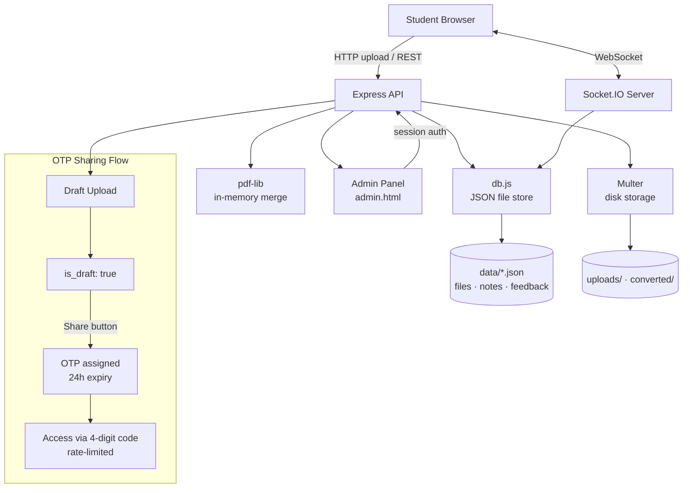

<div align="center">

# 📁 XIE Files

### Instant Campus File Transfer & Smart Print Hub

**Zero-friction file sharing built for one real problem: getting a file from a student's phone to a printer, in seconds, with no app, no login, and no WhatsApp compression.**

[](#)
[](#license)
[](#)
[](#)
[](#)
[](#)
[](#)

[Live Demo](#demo) · [Features](#key-features) · [Architecture](#system-architecture) · [Installation](#installation)

</div>

---

## Overview

**XIE Files** is a real-time, account-free file-sharing and print-preparation tool built for a live college campus — Xavier Institute of Engineering, Mumbai. It was designed and shipped as a production system, not a demo: it is deployed, actively used by students, and has gone through multiple iterations based on real user feedback collected through its own in-app feedback channel.

The product thesis is simple: **on a college campus, the bottleneck to printing or sharing a file is almost never the file itself — it's the friction around it.** WhatsApp compresses images and shrinks PDFs. Google Drive requires a Google account and manual permission changes. USB drives require finding a working port and hoping the printer PC isn't infected. XIE Files removes every one of those steps: open a URL, drop a file, and it is live for everyone on the network in under a second — or, if it's meant for one person, share it privately with a 4-digit code that expires on its own.

This project also serves as a demonstration of production engineering judgment: every feature ships with a documented trade-off analysis (see [Challenges Faced](#challenges-faced)), not just a working demo.

---

## Problem Statement

Inside an engineering college, moving a file from "on my phone" to "in my hand, printed" involves a surprising number of broken steps:

| Common workflow | What actually goes wrong |
|---|---|
| Send file via WhatsApp | Images get compressed, PDFs sometimes get corrupted or capped in quality |
| Share via Google Drive | Requires a Google account, manual "anyone with the link" permission changes, and Drive's UI isn't built for walk-up-and-print use |
| Carry a USB drive | Port might not work, print-shop PC might reject the format or be infected, physical object can be lost |
| Ask a friend to print and hand it over | Depends entirely on someone else's schedule and memory |
| Print-shop portals (where they exist) | Often clunky, require signup, and aren't built for casual one-off use |

**XIE Files' answer:** a shared, ephemeral, real-time file board scoped to campus use — with an explicit private-sharing path for the (very common) case where a file isn't meant for everyone.

---

## Key Features

| Feature | Description | Status |
|---|---|---|
| ⚡ **Instant public sharing** | Drop a file, it appears on every open browser on campus via WebSockets in under a second — no refresh, no login | ✅ Shipped |
| 🔐 **OTP-based private sharing** | Upload files into a private "draft" session, generate a unique 4-digit code, share it with one person or a group — files never touch the public board | ✅ Shipped |
| 🖨️ **In-browser print** | PDFs and images print directly from an inline viewer — no download step required | ✅ Shipped |
| 🧩 **Merge PDF tool** | Combine multiple PDFs with drag-to-reorder, download the merged file — nothing persisted server-side | ✅ Shipped |
| 🗂️ **Universal file previews** | Inline, full-height preview for PDF, images, text/CSV, audio, and video; clean "download to open" fallback for formats that can't render in-browser (no dead-end error states) | ✅ Shipped |
| 💬 **Community feedback loop** | Any student can submit feedback; admin can mark entries as *Featured*, which surface live on the homepage as social proof | ✅ Shipped |
| 🛡️ **Admin control panel** | Password-gated dashboard for file moderation, soft-delete/restore, retention policy configuration, and feedback triage | ✅ Shipped |
| 🚫 **Zero accounts, by design** | No signup, no password, no session for students — the absence of auth *is* the feature (see [Security](#security-model)) | ✅ Shipped |
| ⏳ **Self-cleaning storage** | Files auto-expire after a configurable retention window; unshared OTP drafts auto-purge after 1 hour to prevent orphaned uploads | ✅ Shipped |
| 📝 **Live collaborative notes** | A shared, real-time notice board for campus announcements | ✅ Shipped |

---

## Demo

| | |
|---|---|
| **Live Demo** | `[placeholder — e.g. https://xiefiles.onrender.com]` |
| **Admin Demo** | `[placeholder — /admin.html, credentials on request]` |
| **Video Walkthrough** | `[placeholder — Loom / YouTube link]` |

---

## Tech Stack

| Layer | Technology |
|---|---|
| **Frontend** | React 18, Vite, React Router, Tailwind CSS |
| **Real-time layer** | Socket.IO (file broadcast, live presence, collaborative notes) |
| **Backend** | Node.js, Express |
| **File handling** | Multer (disk storage, multipart uploads), `pdf-lib` (in-memory PDF merge) |
| **Drag & drop** | `@dnd-kit` (accessible, touch-friendly reordering) |
| **Data storage** | Lightweight JSON file store (`db.js`) — zero external DB dependency, atomic read/write per collection |
| **Sessions / Auth** | `express-session` — used *only* for the single admin account, not for students |
| **Access model** | No accounts for students. Public board = open access. Private files = 4-digit OTP session with expiry + rate-limiting |
| **Deployment** | Render (Node web service, persistent disk) |
| **Dev tooling** | Dual dev servers (backend + Vite), `npx kill-port` for local port hygiene |

> **Note on scope:** this project intentionally has no database server (Postgres/Mongo) and no AI layer — the JSON-store approach was a deliberate architectural choice for a single-campus, moderate-throughput tool, documented further in [Challenges Faced](#challenges-faced).

---

## System Architecture



**Design principles behind this architecture:**
- **WebSockets are load-bearing, not decorative** — the "instant" promise of the product depends on Socket.IO broadcasting `file:added` / `file:removed` events the moment state changes, which is why this had to be deployed to a platform supporting persistent connections (see [Challenges Faced](#challenges-faced)).
- **The public board and OTP sessions share one data model** but are filtered at the query layer (`activePublic()` vs `getByOtp()`), not duplicated into separate stores — keeping a single source of truth for file lifecycle (expiry, deletion, purge).

---

## Folder Structure

```
xiefiles/
├── server.js                  # Express app, Socket.IO, all API routes, cron jobs
├── db.js                      # JSON-backed data layer (files, notes, feedback)
├── package.json
├── .env.example
│
├── client/                    # React + Vite frontend
│   ├── src/
│   │   ├── components/
│   │   │   ├── files/         # FileCard, FileIcon, UploadZone, PreviewModal
│   │   │   ├── layout/        # Header, Sidebar, Footer, Layout
│   │   │   └── ui/            # Modal, Skeleton, EmptyState, shared primitives
│   │   ├── context/           # FilesContext, SocketContext, ToastContext, ThemeContext
│   │   ├── pages/              # Home, MergePdf, AccessOtp, Notes, Feedback, Static (About/Help/Recent)
│   │   └── lib/                # api.js (fetch layer), format.js (shared formatters)
│   └── dist/                   # Production build output (generated, not committed)
│
├── public/
│   └── admin.html              # Standalone admin dashboard (Files + Feedback tabs)
│
├── uploads/                    # Original uploaded files (gitignored)
├── converted/                  # PDF conversion output (gitignored)
└── data/                       # xiefiles.json, notes.json, feedback.json (gitignored)
```

---

## User Journey

**Student — Public Sharing**
```
Open XIE Files → Drag a file → Appears on every open browser instantly
     → Preview inline → Print directly from browser, or Download
```

**Student — Private (OTP) Sharing**
```
Switch to "OTP Share" → Upload one or more files (staged as drafts)
     → Click "Share & Get OTP" → Receive 4-digit code → Send code to recipient
Recipient → "Access with OTP" → Enter code → See all files in that batch
     → Preview / Download / Print
```

**Admin**
```
/admin.html → Password login → Files tab (search, filter, soft-delete, restore,
     edit metadata, configure retention) → Feedback tab (review, resolve, feature)
```

---

## Security Model

XIE Files deliberately has **no student authentication** — this is a design decision, not a gap, so it's worth explaining explicitly:

| Concern | How it's handled |
|---|---|
| **Public files** | Intentionally open by design — this is a shared campus board, equivalent to a physical noticeboard |
| **Private files** | Never appear on the public board or in any broadcast event; reachable only via a 4-digit OTP tied to a specific upload batch |
| **OTP guessing resistance** | Failed OTP attempts are rate-limited per IP (5 attempts → 15-minute lockout); OTPs expire after 24 hours regardless of use |
| **Draft cleanup** | Files uploaded in OTP mode but never "shared" are automatically purged after 1 hour, preventing orphaned/abandoned uploads from accumulating |
| **File ownership** | Each upload gets a private ownership token stored client-side; only the uploading browser can delete that file |
| **Admin access** | Single password-gated account (`express-session`), never shared with the OTP/public flow |
| **Input validation** | MIME-type allowlist enforced server-side via Multer `fileFilter`, independent of client-side `accept` attributes |
| **Environment variables** | Admin password and session secret are never hardcoded — sourced from `.env`, excluded from version control |

---

## Installation

### Prerequisites
- Node.js 18+
- npm

### Setup

```bash
# 1. Clone
git clone https://github.com/<your-username>/xiefiles.git
cd xiefiles

# 2. Install backend dependencies
npm install

# 3. Install and build the frontend
cd client
npm install
npm run build
cd ..

# 4. Configure environment
cp .env.example .env
# edit .env with your own ADMIN_PASSWORD and SESSION_SECRET

# 5. Run
node server.js
```

### Development mode (hot-reload frontend)

```bash
# Terminal 1 — backend
node server.js

# Terminal 2 — frontend dev server
cd client && npm run dev
```

### Production deployment

Deployed as a standard Node web service on **Render** (persistent disk enabled for `uploads/`, `converted/`, `data/`). Build command: `npm install && npm run build` (chained to also build the React client). See [Challenges Faced](#challenges-faced) for platform-fit reasoning.

---

## Environment Variables

| Variable | Description | Example |
|---|---|---|
| `PORT` | Server port (Render sets this automatically in production) | `3000` |
| `ADMIN_PASSWORD` | Password for the admin dashboard | `<your-secure-password>` |
| `SESSION_SECRET` | Secret used to sign admin session cookies | `<long-random-string>` |
| `MAX_FILE_SIZE_MB` | Max upload size per file | `100` |
| `EXPIRY_DAYS` | Days before a file auto-expires | `30` |
| `PERMANENT_DELETE_AFTER_DAYS` | Days after soft-delete before permanent purge | `7` |

> No secrets are committed to this repository. `.env` is gitignored; see `.env.example` for the required shape.

---

## API Overview

| Method | Endpoint | Purpose |
|---|---|---|
| `POST` | `/api/upload` | Upload a file (public, or draft for OTP flow) |
| `GET` | `/api/files` | List active public files |
| `GET` | `/api/files/:id/download` | Download a file (supports `?otp=` for private access) |
| `GET` | `/api/files/:id/pdf` | Inline PDF/preview stream |
| `DELETE` | `/api/files/:id` | Delete a file (owner-token protected) |
| `POST` | `/api/otp/share` | Convert a draft batch into an active OTP session |
| `POST` | `/api/otp/access` | Validate an OTP and retrieve its files (rate-limited) |
| `POST` | `/api/merge-pdf` | Merge uploaded PDFs server-side, stream back the result |
| `GET` / `POST` | `/api/notes` | Live collaborative notes board |
| `POST` | `/api/feedback` | Submit feedback |
| `GET` | `/api/feedback/featured` | Public list of admin-featured feedback |
| `POST` | `/api/admin/login` | Admin authentication |
| `GET` | `/api/admin/files` | Admin file listing (search/filter/soft-deleted) |
| `PATCH` | `/api/admin/feedback/:id/feature` | Toggle featured status on feedback |

---

## Future Roadmap

- [x] Real-time public file sharing
- [x] OTP-based private sharing with rate-limiting
- [x] Merge PDF tool
- [x] Universal preview system (no dead-end errors)
- [x] Admin dashboard with featured feedback
- [ ] LibreOffice-based DOCX/PPTX/XLSX in-browser preview (requires containerized deployment)
- [ ] Direct-to-object-storage uploads for files >250MB
- [ ] Multi-college / multi-tenant support
- [ ] Print-shop queue integration

---

## Challenges Faced

**Platform fit for WebSockets.** Early architecture decisions ruled out serverless platforms (Vercel, Netlify) despite their popularity, because the product's core promise — instant sync — depends on long-lived WebSocket connections and persistent local disk, neither of which serverless functions provide. This pushed the deployment target to a persistent Node host (Render) instead.

**DOCX/PPTX/XLSX preview trade-off.** True in-browser preview for Office formats requires LibreOffice server-side conversion, which isn't available on Render's default Node runtime without a custom Docker image. Rather than ship a broken "Conversion Failed" state, the product was redesigned to gracefully degrade: any file that can't be natively previewed gets a clean "Download to open" affordance instead of an error — a deliberate UX decision over a technically "complete" but confusing one.

**OTP batch-sharing race condition.** An early implementation of multi-file OTP sharing generated a new batch ID per file inside an async upload loop, using React state. Because state updates are asynchronous and the loop's closures captured a stale value, every file in a single "session" silently received a different batch ID — so only the last uploaded file ever got linked to the generated OTP. The fix replaced the batch ID with a `useRef` (synchronous, mutation-safe across the loop) rather than `useState`, a good illustration of a subtle-but-common React state/closure bug.

**Storage architecture without a database server.** Choosing a JSON-file data layer over Postgres/Mongo was a deliberate trade-off for a single-instance, moderate-scale campus tool — it avoids provisioning and connection-pooling complexity, at the cost of not being horizontally scalable. This is documented as a known constraint, not an oversight.

---

## What I Learned

- How to reason about **platform constraints as architecture inputs** — not every "standard" deployment target (serverless) fits every product's runtime requirements.
- The difference between a **feature-complete implementation and a good user experience** — a working conversion pipeline that occasionally fails is worse than an honest, graceful fallback.
- Diagnosing **state-management race conditions** in React that don't throw errors but silently produce wrong data — and the difference between `useState` and `useRef` in async loops.
- Designing **security models for zero-authentication systems** — proving that "no login" doesn't have to mean "no protection," via scoped tokens, OTP rate-limiting, and time-bound expiry.
- Iterating a product **based on real user feedback** collected through the product's own feedback channel, rather than hypothetical requirements.

---

## Why This Project Matters

XIE Files demonstrates:

- **Full-stack ownership** — from Socket.IO event design to React state architecture to Render deployment configuration.
- **Real-time systems engineering** — WebSocket broadcast patterns, presence tracking, live collaborative state.
- **Security-by-design without traditional auth** — rate-limited OTP access, scoped ownership tokens, admin/student privilege separation.
- **Production trade-off reasoning** — every major technical decision (JSON store vs. database, no DOCX preview vs. Docker, serverless vs. persistent host) is documented with its actual constraint, not glossed over.
- **Shipping and iterating on a live product** — this isn't a tutorial clone; it's deployed, has real users, and has been revised based on their feedback.

---

## Contributing

This project was built for a specific campus deployment, but contributions, issue reports, and architectural suggestions are welcome.

1. Fork the repository
2. Create a feature branch (`git checkout -b feature/your-feature`)
3. Commit with a clear, descriptive message
4. Open a pull request describing the change and its motivation

---

## License

MIT License — see `LICENSE` for details.

---

## Contact

**Prashik Dongre**
Department of Information Technology · Xavier Institute of Engineering, Mumbai

`[GitHub]` · `[Email]` · `[LinkedIn]`

</div>
